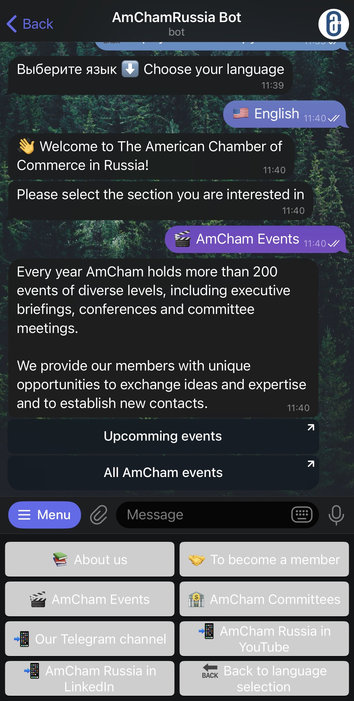

# AmChamRuBot 🌐

Bilingual Telegram bot for AmCham Russia events navigation: RU/EN menu, quick links, and user activity logging.  

🖥️ The production version runs on a private VPS (24/7 uptime).  
🔒 This repository is portfolio-only: it contains example code, requirements, README, and CI — no secrets or tokens.  
👉 Try the live bot: [t.me/AmChamRuBot](https://t.me/AmChamRuBot)

---

## Features
- Bilingual menu (RU/EN)  
- Quick links to events and channels  
- User activity logging in SQLite  
- `/track_users` command for admins  

## Tech Stack
Python · pyTelegramBotAPI · SQLite  

---

## Demo

> See [PORTFOLIO_ONLY.md](PORTFOLIO_ONLY.md) for portfolio disclaimer.

---

---

> Версия на русском: [README.md](README.md)
